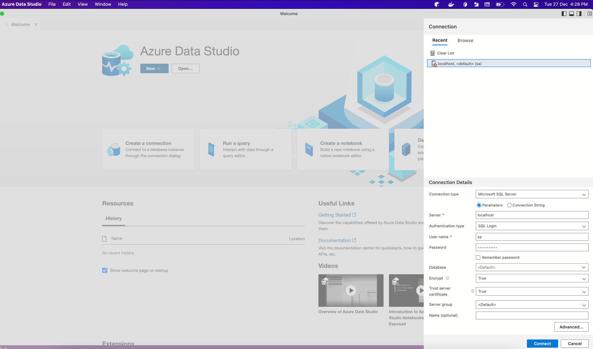
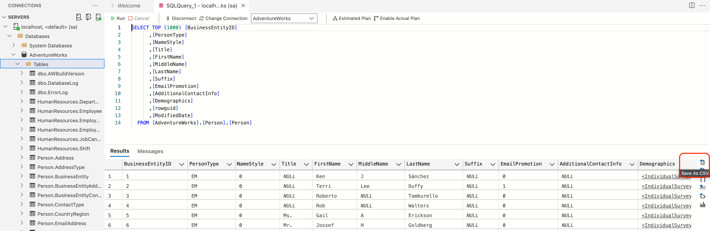

# Datasource Mocking Guide for DataPipes

This page describes how to prepare your mac laptop for preparing datapipes test data

<br/>

## Assumptions

This article assumes the following:
* Your Corporate IT has already installed the Certificate Authority and MDM profile on your MacOS.
* You are using macOS 10.13 or higher (essential, if you want to install PowerShell)

<br/>

## Homebrew - A Package Manager For MacOS

A package manager basically allows you to install applications on your computer via command line.
No more "drag to install" on MacOS.

Navigate to https://brew.sh and follow the guide to install Homebrew via bash.

> Copy and paste the command in Terminal to install Homebrew:

```bash
/bin/bash -c "$(curl -fsSL https://raw.githubusercontent.com/Homebrew/install/HEAD/install.sh)"
```

<br/>

## Packages for DataPipes data sources

> Copy and paste the command in Terminal to install applications to facilitate mocking of test data:

```bash
brew install --cask docker azure-data-studio
```

## Downloading Docker Images with Sample Data

You can run a copies of realistic looking mock databases on your computer before hosting them on the cloud for direct integration.

</br>

### CSV

1. Run a copy of adventureworks MS SQL Server database in docker.

AdventureWorks Database is a Microsoft product sample for an online transaction processing (OLTP) database. The AdventureWorks Database supports a fictitious, multinational manufacturing company called Adventure Works Cycles.

```bash
# Downloads an opensource version of adventureworks
docker pull chriseaton/adventureworks

# Run the adventureworks database within docker
docker run -p 1433:1433 -e 'ACCEPT_EULA=Y' -e 'SA_PASSWORD=P@55w0rd' -d chriseaton/adventureworks:latest
```

2. Launch azure data studio to connect to AdventureWorks Sample Database



3. Export database table of interest as a CSV



### MS SQL Server

1. Inform Datapipes DevOps team to provision an instance of chriseaton/adventureworks [To Be Confirm]

> More data sources will be identified... 